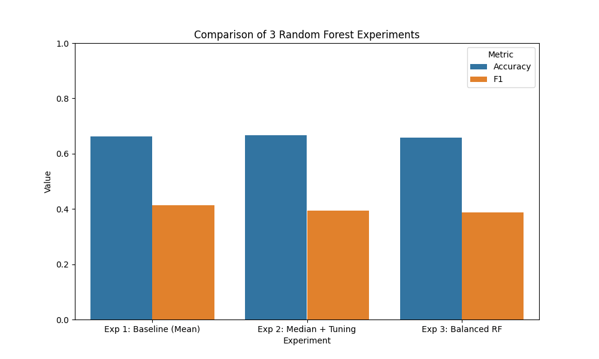

Public Portfolio Post
Can Machine Learning Predict Safe Drinking Water?
Clean drinking water is something most people never question. We turn on a faucet and assume what comes out is safe. In reality, determining water safety is very difficult and depends on a mix of chemical properties that aren’t always easy to evaluate quickly.
That led me to the question:
Can a machine learning model predict whether water is safe to drink using only its chemical and physical properties?

Why This Problem Matters

Testing water quality in the real world is expensive and time consuming. Comprehensive lab testing is accurate, but not always practical at large scale. If a model could use commonly collected measurements like pH or sulfate levels to flag potentially unsafe water, it could:

Help prioritize which samples need deeper testing
Support monitoring in remote or under served areas
Serve as an early warning system for contamination
For that to work, the model has to have high accuracy and it has to make the right kinds of predictions.

I began with a straightforward approach: a Random Forest model trained on a dataset of over 3,000 water samples, each labeled as safe or unsafe.

At first, the results were about 65% accuracy which seemed somewhat promising. However, the model was mostly learning how to predict unsafe water. Since the dataset contained more unsafe samples than safe ones, the model was taking the easiest path defaulting toward the majority class. That meant it wasn’t very good at identifying safe drinking water, which is the outcome that actually matters.

Instead of jumping to a more complex model, I focused on improving how the data was handled.
Some of the most important features like pH and sulfate levels had missing values. Initially I filled these using mean, but chose to swap to using median as it is more resistant to outliers. Switching to median imputation made the data more realistic and slightly improved performance.
I also checked for other data processing that might of needed to be done but the dataset ending up needing minimal preprocessing only having to fill in missing values.

Tuning the Model

I adjusted the model to reduce overfitting by:

Limiting tree depth and increasing the number of trees. This helped the model generalize better, increasing accuracy to about 67%.
The biggest shift came when I addressed class imbalance. By weighting the model to pay more attention to the minority class (safe water), it became better at identifying potable samples.
This didn’t significantly increase accuracy but it made the model more aligned with the real world goal.

What the Model Revealed

Two features consistently stood out in importance:

Sulfates – the strongest predictor, often linked to contamination or mineral content
pH levels – critical for determining whether water is chemically safe to consume

These results reflect real world water quality standards, suggesting the model was learning meaningful connections.

What I Learned

This project changed how I think about machine learning.

I first thought success came from choosing the right model. Instead I found that the most important parts were:

How missing data is handled
How imbalance in the dataset is addressed
How performance is evaluated beyond accuracy

There is one thing that really stood out and that is that a model can look good on paper while still failing at the task that actually matters.
This project shows that machine learning isn’t just about prediction and that it’s about decision making.

A model like this could help:

Monitor water quality more efficiently
Support environmental agencies
Expand access to safe water in underserved areas

It is important to say this is not a replacement for lab testing but it could be a powerful tool for deciding where to focus attention.

Technical Report
1. Dataset & Problem Framing
Dataset: Water Potability Dataset (Kaggle)
Size: ~3,276 samples, 9 features + 1 target
Target Variable: Potability
0 = Not safe
1 = Safe
Research Question

Can a machine learning model accurately classify water as potable using chemical and physical properties?

2. Data Preprocessing & Assumptions
Missing Values

Missing data present in:

pH
Sulfate
Trihalomethanes
Approaches Used
Experiment 1: Mean imputation
Experiment 2 & 3: Median imputation

Rationale:
Median is more robust to outliers, which are common in environmental data.

Feature Handling
All features are numerical → no encoding required
No normalization applied (Random Forest is scale-invariant)
Train/Test Split
80/20 split
Stratified sampling used to preserve class distribution
3. Model Experiments

All experiments used Random Forest Classifier.

Experiment 1: Baseline
Mean imputation
Default hyperparameters
Number of trees: 100
Max features Square root of total features.
Max depth: None
Min Samples per Leaf: 1

Purpose: Establish baseline performance

Result: ~65% accuracy

Experiment 2: Tuned Model
Median imputation
Increased number of trees: 200
Limited max depth: 15

Rationale:

Reduce overfitting,
Improve generalization

Result: ~67% accuracy

Experiment 3: Class Imbalance Adjustment
Same as Experiment 2
Added class_weight = 'balanced'

Rationale:

Dataset skewed toward non-potable samples,
Improve detection of minority class (safe water)

Outcome:

Improved balance in predictions
Better F1 score for potable class
4. Model Evaluation & Interpretation
Metrics Used
Accuracy
F1 Score
Key Findings
Baseline model biased toward majority class
Tuned model improved generalization slightly
Balanced model improved meaningful performance (minority class detection)
Interpretation
Accuracy alone was insufficient due to imbalance
F1 score provided better insight into real performance
Model improvements were driven more by preprocessing than algorithm changes
5. Feature Importance

Top contributing features:

Sulfates
pH

Interpretation:
These features align with real world water safety indicators, suggesting the model captured meaningful relationships.

6. Limitations, Ethics, & Reflection
Limitations
No biological contaminants included
No geographic or temporal data
Moderate dataset size
Ethical Considerations
False positives (unsafe water labeled safe) are high-risk
Model should assist—not replace—lab testing
Reflection
Data preprocessing had the largest impact on results
Model performance depends heavily on how the problem is framed
7. Code Quality & Reproducibility
Structured workflow with clear experiment stages
Consistent preprocessing pipeline
Results stored and compared systematically
Reproducibility Steps
Load dataset
Apply preprocessing (mean/median imputation)
Split data (80/20 stratified)
Train Random Forest models
Evaluate using accuracy and F1 score
Compare results across experiments
Citation

(Synthetically generated)
Kadiwal, A. (2020). Water Potability Dataset. Kaggle
https://www.kaggle.com/datasets/adityakadiwal/water-potability

